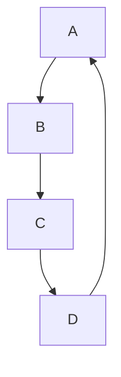
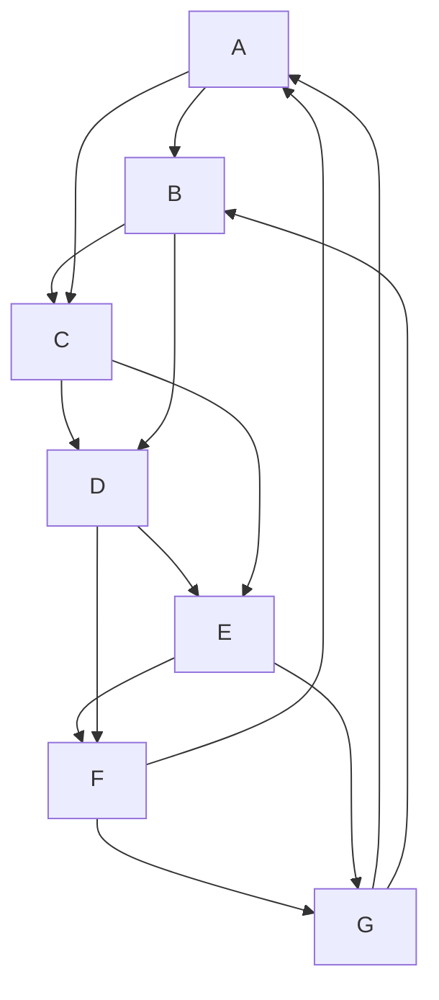

# 6.

## Problem Statement
If a graph \( G \) with \( v \) vertices and \( e \) edges is connected and has \( v < e + 1 \), must it contain a cycle? Prove your answer.

## Answer
Yes, the graph \( G \) must contain a cycle. Here's the proof:

1. **Understanding the inequality \( v < e + 1 \)**:
   - Rearrange the inequality: \( v - 1 < e \).
   - This means that the number of edges \( e \) is greater than \( v - 1 \).

2. **Tree Properties**:
   - A tree is a connected acyclic graph.
   - A tree with \( v \) vertices has exactly \( v - 1 \) edges.

3. **Implication for Graph \( G \)**:
   - Since \( G \) is connected and has \( e \) edges where \( e > v - 1 \), \( G \) has more edges than a tree with the same number of vertices.

4. **Cycle Formation**:
   - If we add an edge to a tree, it creates a cycle because a tree is minimally connected (removing any edge would disconnect it).
   - Given \( G \) has more edges than a tree, it implies there must be at least one extra edge that introduces a cycle.

Therefore, if a graph \( G \) with \( v \) vertices and \( e \) edges is connected and satisfies \( v < e + 1 \), the graph must contain at least one cycle.

## Example Graph

Consider the following example:

- Let \( G \) be a graph with \( v = 4 \) vertices and \( e = 4 \) edges.
- According to the condition, \( 4 < 4 + 1 \) holds true.

### Graph Representation

Vertices: \( \{A, B, C, D\} \)

Edges: \( \{ (A, B), (B, C), (C, D), (D, A) \} \)

This graph is a cycle \( C_4 \) and is visualized as follows:

Answer provided: Yes. We will prove the contrapositive. Assume G does not contain a cycle. Then G is a tree, so would have v = e + 1, contrary to stipulation.

# 14.

## Example: Constructing a Graph with 7 Different Spanning Trees

To demonstrate a graph with exactly 7 different spanning trees, we'll construct a simple connected graph with 5 vertices and incrementally add edges to create distinct spanning trees.

### Graph Construction

- **Vertices**: \( \{A, B, C, D, E\} \)
- **Edges**: \( \{(A, B), (A, C), (A, D), (A, E), (B, C), (C, D), (D, E), (E, B)\} \)

#### Graph Visualization

