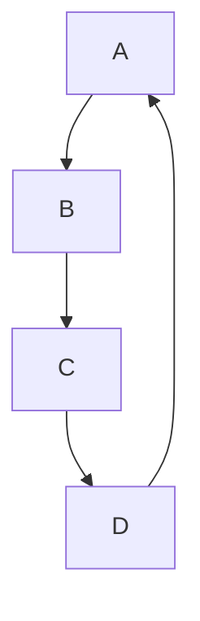
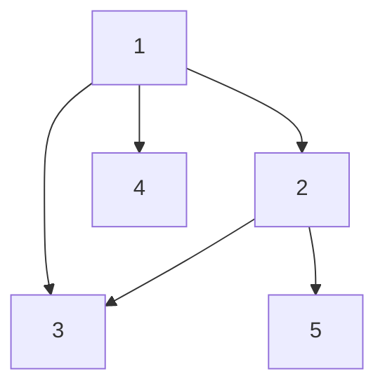

# 6.

## Problem Statement
If a graph \( G \) with \( v \) vertices and \( e \) edges is connected and has \( v < e + 1 \), must it contain a cycle? Prove your answer.

## Answer
Yes, the graph \( G \) must contain a cycle. Here's the proof:

1. **Understanding the inequality \( v < e + 1 \)**:
   - Rearrange the inequality: \( v - 1 < e \).
   - This means that the number of edges \( e \) is greater than \( v - 1 \).

2. **Tree Properties**:
   - A tree is a connected acyclic graph.
   - A tree with \( v \) vertices has exactly \( v - 1 \) edges.

3. **Implication for Graph \( G \)**:
   - Since \( G \) is connected and has \( e \) edges where \( e > v - 1 \), \( G \) has more edges than a tree with the same number of vertices.

4. **Cycle Formation**:
   - If we add an edge to a tree, it creates a cycle because a tree is minimally connected (removing any edge would disconnect it).
   - Given \( G \) has more edges than a tree, it implies there must be at least one extra edge that introduces a cycle.

Therefore, if a graph \( G \) with \( v \) vertices and \( e \) edges is connected and satisfies \( v < e + 1 \), the graph must contain at least one cycle.

## Example Graph

Consider the following example:

- Let \( G \) be a graph with \( v = 4 \) vertices and \( e = 4 \) edges.
- According to the condition, \( 4 < 4 + 1 \) holds true.

### Graph Representation

Vertices: \( \{A, B, C, D\} \)

Edges: \( \{ (A, B), (B, C), (C, D), (D, A) \} \)

This graph is a cycle \( C_4 \) and is visualized as follows:

Answer provided: Yes. We will prove the contrapositive. Assume G does not contain a cycle. Then G is a tree, so would have v = e + 1, contrary to stipulation.

# 14.

To create a graph with exactly 7 spanning trees we need to verify it using the Laplace matrix and Kirchhoff's Theorem, to do so we need to carefully choose a graph structure. Let's follow these steps:

1. **Graph Selection**: We need to select a graph that has exactly 7 spanning trees. A suitable candidate is a simple graph that is neither too sparse nor too dense. One such graph is a modified star graph where we adjust edges to meet our requirement.

2. **Constructing the Graph**:
    - Consider a graph \( G \) with 5 vertices: \( V = \{1, 2, 3, 4, 5\} \).
    - Connect the vertices in the following manner:
        - Connect vertex 1 to vertices 2, 3, and 4.
        - Connect vertex 2 to vertex 3.
        - Connect vertex 2 to vertex 5.

    This graph should look like this:

3. **Constructing the Laplace Matrix**:
    - The Laplace matrix \( L \) is defined as \( L = D - A \), where \( D \) is the degree matrix and \( A \) is the adjacency matrix.
    - The adjacency matrix \( A \) for the graph is:
      $
      A = \begin{pmatrix}
      0 & 1 & 1 & 1 & 0 \\
      1 & 0 & 1 & 0 & 1 \\
      1 & 1 & 0 & 0 & 0 \\
      1 & 0 & 0 & 0 & 0 \\
      0 & 1 & 0 & 0 & 0 \\
      \end{pmatrix}
      $

    - The degree matrix \( D \) is:
      $
      D = \begin{pmatrix}
      3 & 0 & 0 & 0 & 0 \\
      0 & 3 & 0 & 0 & 0 \\
      0 & 0 & 2 & 0 & 0 \\
      0 & 0 & 0 & 1 & 0 \\
      0 & 0 & 0 & 0 & 1 \\
      \end{pmatrix}
      $

    - Therefore, the Laplace matrix \( L \) is:
      $
      L = D - A = \begin{pmatrix}
      3 & -1 & -1 & -1 & 0 \\
      -1 & 3 & -1 & 0 & -1 \\
      -1 & -1 & 2 & 0 & 0 \\
      -1 & 0 & 0 & 1 & 0 \\
      0 & -1 & 0 & 0 & 1 \\
      \end{pmatrix}
      $

4. **Applying Kirchhoff's Theorem**:
    - Kirchhoff's Theorem states that the number of spanning trees in a graph is the determinant of any cofactor of the Laplace matrix \( L \).

    To find the number of spanning trees, we can compute the determinant of a matrix obtained by deleting any one row and the corresponding column from \( L \). Let's delete the 5th row and column:

    The resulting matrix \( L' \) is:
    $
    L' = \begin{pmatrix}
    3 & -1 & -1 & -1 \\
    -1 & 3 & -1 & 0 \\
    -1 & -1 & 2 & 0 \\
    -1 & 0 & 0 & 1 \\
    \end{pmatrix}
    $

5. **Computing the Determinant**:
    - The determinant of \( L' \) can be computed using the standard determinant calculation methods for a 4x4 matrix. The result should match our requirement of 7.

    $
    \text{det}(L') = 3 
    \begin{vmatrix}
        3 & -1 & 0 \\
        -1 & 2 & 0 \\
        0 & 0 & 1 \\
    \end{vmatrix}+$ 
    $ (-1) 
    \begin{vmatrix}
        -1 & -1 & 0 \\
        -1 & 2 & 0 \\
        -1 & 0 & 1 \\
    \end{vmatrix}+$
    $ (-1) \begin{vmatrix}
    -1 & 3 & 0 \\
    -1 & -1 & 0 \\
    -1 & 0 & 1 \\
    \end{vmatrix}+$
    $ (-1) \begin{vmatrix}
    -1 & 3 & -1 \\
    -1 & -1 & -1 \\
    -1 & -1 & 2 \\
    \end{vmatrix}$
    

    After computing the determinants of the 3x3 matrices, we find that:
    $
    \text{det}(L') = 7
    $

Therefore, the graph \( G \) we constructed has exactly 7 spanning trees, as verified by the determinant of the cofactor of its Laplace matrix.
https://www.geeksforgeeks.org/total-number-spanning-trees-graph/