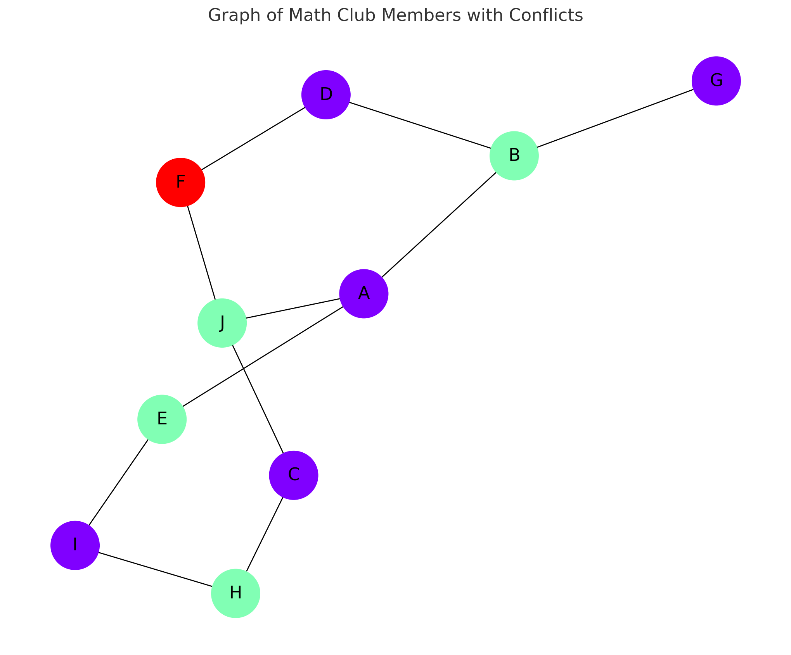
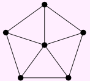

## 7. The two problems below can be solved using graph coloring. For each problem, represent the situation with a graph, say whether you should be coloring vertices or edges and why, and use the coloring to solve the problem.

a. Your Quidditch league has 5 teams. You will play a tournament next week in which every team will play every other team once. Each team can play at most one match each day, but there is plenty of time in the day for multiple matches. What is the fewest number of days over which the tournament can take place?

.png)

> It would be 5 days since each of the 5 colors would represent the 5 days and the edges would represent the 2 days that they can play per day.  

b. Ten members of Math Club are driving to a math conference in a neighboring state. However, some of these students have dated in the past, and things are still a little awkward. Each student lists which other students they refuse to share a car with; these conflicts are recorded in the table below. What is the fewest number of cars the club needs to make the trip? Do not worry about running out of seats, just avoid the conflicts.

$ Vertex set: {A,B,C,D,E,F,G,H,I,J}$

$Edge set: (A−B),(A−E),(A−J),(B−A),(B−D),(B−G),(C−H),(C−J),(D−B),(D−F),(E−A),(E−I),(F−D),(F−J),(G−B),(H−C),(H−I),(I−E),(I−H),(I−J),(J−A),(J−C),(J−F),(J−I)$

> We use the conflicting sets that conflict to make our graphs

$Conflictsets:{(A−B),(A−E),(A−J),(B−D),(B−G),(C−H),(C−J),(D−F),(E−I),(F−J),(H−I)}$

## 9. Not all graphs are perfect. Give an example of a graph with chromatic number 4 that does not contain a copy of $K_4$. That is, there should be no 4 vertices all pairwise adjacent.
The wheel graph below has this property. The outside of the wheel forms an odd cycle, so requires 3 colors, the center of the wheel must be different than all the outside vertices.

