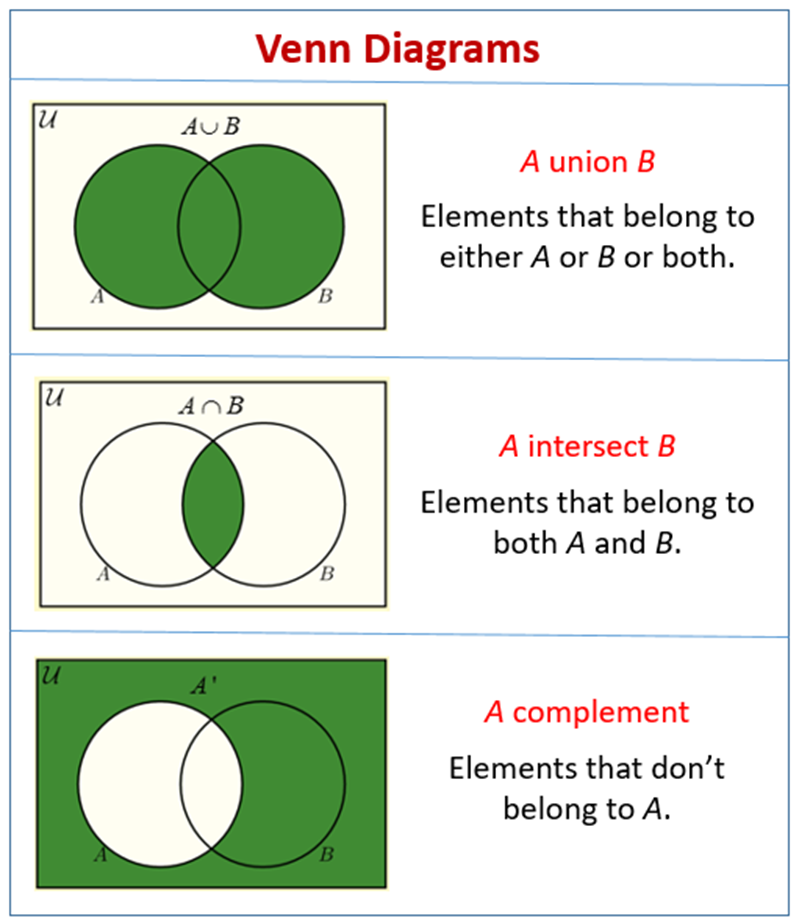

 

A Venn diagram is a graphical representation used to show the relationships between sets of elements. It consists of overlapping circles (or other shapes) where each circle represents a set, and the overlapping areas represent the elements that belong to multiple sets. The non-overlapping areas represent elements that belong exclusively to one set.

 

1. **Sets**: Each circle in a Venn diagram represents a set of elements. These sets can represent any category or group of items.

2. **Overlap**: The overlapping areas between the circles represent elements that belong to more than one set. The size of the overlap indicates the degree of commonality between the sets.

3. **Non-overlapping Areas**: The parts of each circle that do not overlap with any other circle represent elements that are unique to that particular set.

4. **Usage**:

   
- **Logic and Mathematics**: Venn diagrams are commonly used in logic, mathematics, and statistics to visually represent relationships between different sets, such as intersections, unions, complements, and subsets.

  
 - **Problem-solving**: They are useful for solving problems involving set theory, probability, and logic by visually organizing information and identifying relationships between different sets.

  
 - **Education**: Venn diagrams are often used in education to teach concepts related to set theory, logic, and classification. They help students visualize relationships between different groups of items.

  
 - **Data Analysis**: In data analysis, Venn diagrams can be used to compare and contrast different data sets, identify commonalities and differences between groups, and visualize overlaps between categories or groups.

  
 - **Decision Making**: Venn diagrams can aid in decision-making processes by visually representing options, criteria, and their intersections to help identify the best course of action.

Overall, Venn diagrams are a versatile and effective tool for visually organizing information, analyzing relationships between sets, and solving problems in various fields.

